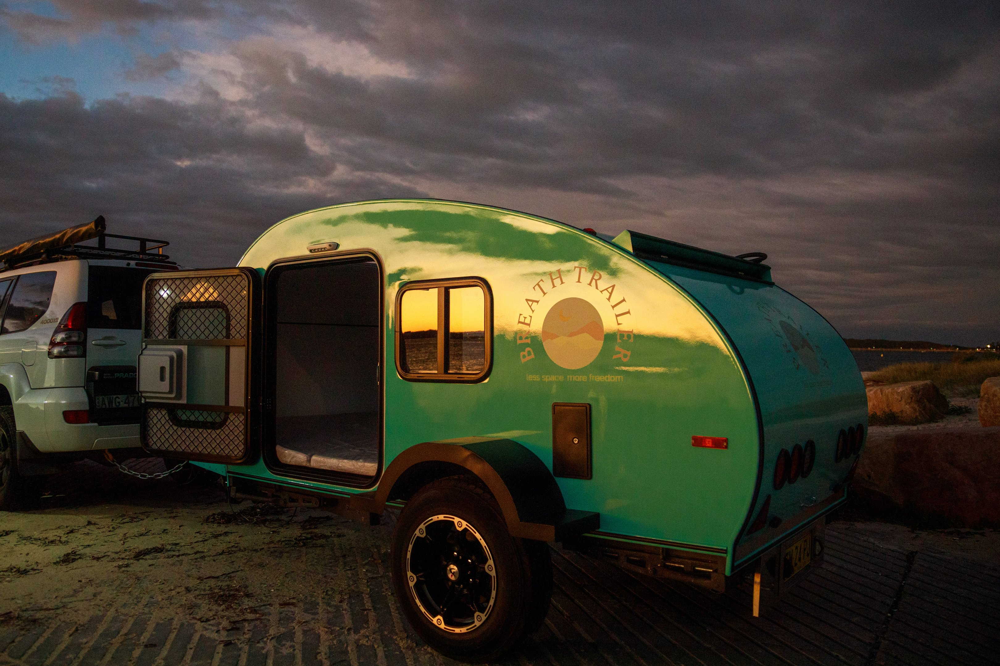

# BreathTrailer Owner’s Manual

**Official Technical & User Documentation**

Designed for safe operation, off-grid camping, and everyday usability — this manual provides clear guidance on how to operate all systems installed in your **BreathTrailer**.

---

## Welcome

This manual has been created to help owners confidently use their trailer **without the need for constant technical support**.

Whether you are camping off-grid or connected to site power, this guide explains how each system works and how to use it safely.

---

## What This Manual Covers

- 🔋 **Power Systems**  
  Battery charging, solar, inverter, and 240V city power

- 💧 **Water Systems**  
  Clean water, grey water, hot water system, and kitchen sink

- ❄️ **Appliances**  
  Fridge operation and 12V systems

- 🌤️ **Outdoor Equipment**  
  Awning, shower tent, and external features

- 🛠️ **Maintenance & Safety**  
  Daily operation, troubleshooting, and long-term care

---

## Quick Start

If this is your first time using the trailer, start here:

- 👉 **Getting Started**  
  Trailer coupling, safety information, and first use

- 👉 **Power Systems**  
  How to manage battery, solar, inverter, and camp power

- 👉 **Water Systems**  
  Tanks, hot water, and kitchen sink operation

- 👉 **Maintenance & Troubleshooting**  
  Daily checks and common issues

Use the navigation menu on the left to access each section.

---

!!! warning
    Always read the **Safety Information** section before operating electrical or gas systems.  
    Incorrect use may result in damage, injury, or loss of warranty.

---

## Built for Adventure

The BreathTrailer is designed for reliability, simplicity, and off-grid capability.

This manual will be updated as systems evolve — always refer to the **latest version** when operating your trailer.

---

© BreathTrailer • All rights reserved
